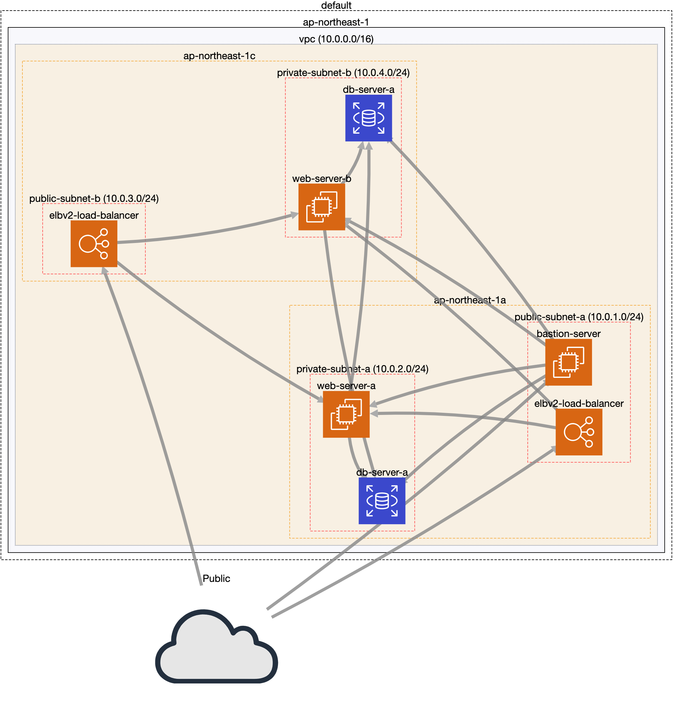

# PracticeAWSCLI

## 動作環境
[AWS CLI]  
aws-cli/1.17.13 Python/3.7.6 Darwin/19.3.0 botocore/1.14.13

[python]  
Python 3.8.1

[Mac]  
macOS Catalina

## ネットワーク構成図


[CloudMapper](https://github.com/duo-labs/cloudmapper)
## 実行手順

```
# aws構築
sh main.sh
```

```
# apache、mysql-clientのインストール
ansible-playbook -i ./ansible/inventory/hosts ./ansible/playbook.yml
```
